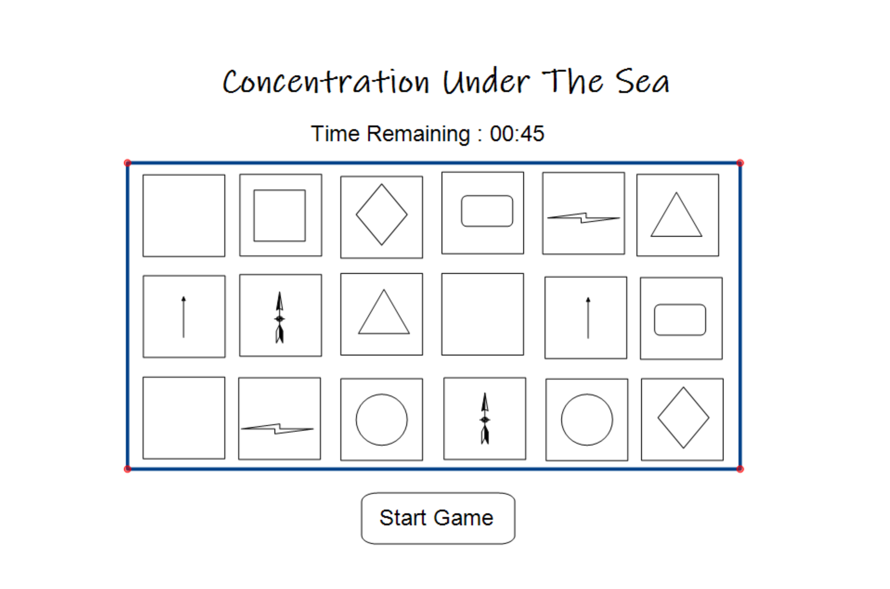

# Title: Memory Game / Concentration

Game History: The first published game form of concentration, was in 1959 by Ravensburger. However it is stated that in the 16th century people in Japan matched pictures painted on shells.

## Technologies Used: 

- HTML
- CSS
- JavaScript

Link To Game: https://github.com/Tessabaxter12/Memory_Game

Game Rules: This is a one player game, that takes attention and concentration. The game begins when the player hits the start game button, which also starts the timer. The player selects two cards that turn over. If the cards match they stay flipped over and you keep playing. If they don't match then the cards turn back over. Player will keep playing till all the cards are matched or timer runs out. A message will show you win or you lose.

## Wireframe

## Users Stories

As a user I want to
- Click start game button and have the game start
- See the timer start once start button is clicked and see the time running.
- See you win or you loose

## Psuedocode

- Define constants
    - Game Board
    - Time
    - Start Button
    - Results

- Define variables
    - Cards
    - Winner
    - Matched

- Intializing the game and timer starts

- Function player selects two cards, they flip over.

- Function to determine match. If a match the cards will stay facing, and keep playing. Else cards flip back over and keep playing.

- Render Results When
    - Time out
    - Cards all matched
    - Declair you win or you loose